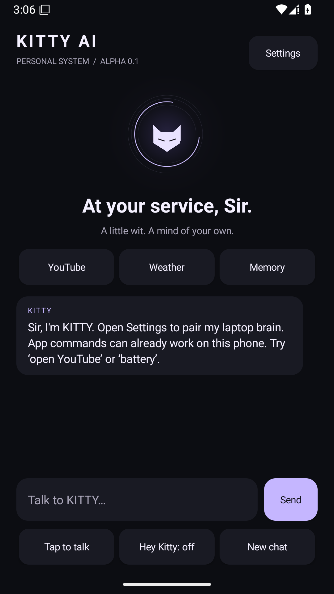

# KITTY AI 0.2

**Updating an existing installation? Start with [the 0.2 update guide](docs/UPDATE_0_2.md).** It covers preserving data, APK signing migration, offline voice and the optional smaller model.


[](https://github.com/psychspy7/KITTY.AI/actions/workflows/verify.yml)

**Your phone. Your laptop brain. At your service, Sir.**

KITTY is an early personal-use Android assistant with local phone commands and a laptop-hosted language model. Virat created the KITTY project. Her personality is female, candid, witty, occasionally darkly humorous, and addresses her owner as **Sir**. No paid AI API key is required.

**Start here: [Windows + Android setup](docs/SETUP_WINDOWS.md)** · [Personalization and training](docs/TRAINING.md) · [Architecture](docs/ARCHITECTURE.md) · [Testing and limitations](docs/QA.md)



Actual Android emulator screenshot. [Recorded alpha verification](docs/validation/ALPHA_0_1.md).

## Current test build

| Feature | Implemented behavior |
| --- | --- |
| Voice and chat | Streamed text, sentence-by-sentence speech, Stop, and imported Vosk for offline tap-to-talk / “Hey Kitty” |
| Apps and YouTube | Opens installed apps and YouTube search results; select a visible result to play it |
| Calls | Resolves contacts on the phone; dialer by default, optional direct calling; asks when names/numbers are ambiguous |
| WhatsApp | Opens an addressed draft; an explicit `Hey Kitty, tap Send` can press a unique visible Send control |
| Screen control | Accessibility for labels, typing and scrolling; optional Shizuku for navigation and coordinate taps |
| Internet | Browser searches and live, attributed Open-Meteo weather; no general web-reading agent yet |
| Personalization | Virat creator identity, editable personality, saved chat/feedback, explicit memory, retrieval and reviewed export |

This is a starting point for months of real-device testing. It does not yet have general autonomous screen planning, verified WhatsApp delivery, a low-power wake-word engine, or universal administrator/root access. Android permissions remain under your control. Model responses are conversation; only supported explicit user commands trigger phone actions.

## Requested brain configuration

| Setting | Value |
| --- | --- |
| Model | Qwen3.5-4B-Abliterated, community derivative |
| Selected GGUF publisher | `mradermacher/Qwen3.5-4B-abliterated-GGUF`, derived from `wangzhang/Qwen3.5-4B-abliterated` |
| Format / quantization | GGUF / Q4_K_M |
| Runtime | llama.cpp |
| Local model API | OpenAI-compatible `http://127.0.0.1:8080/v1`, alias `kitty` |
| Context | 4096 on the 8 GB laptop; short recent history, full archive retained |
| Phone gateway | Python 3.11+, `http://127.0.0.1:8765`, pairing-token authentication |

The downloader resolves and records the exact model revision and SHA-256 on first download. The model is not bundled in the APK and has not been fine-tuned by this project. The separate model compatibility workflow downloads and tests the real weights. An OpenAI-compatible local API does not require an OpenAI account.

## Setup sequence

1. Download this repository and install Python 3.11+ on your laptop.
2. Run `SETUP_KITTY.bat`, then `DOWNLOAD_MODEL.bat`.
3. Extract a compatible official llama.cpp Windows runtime into `runtime/`.
4. Run `START_MODEL.bat` and `START_KITTY.bat`; keep both windows open.
5. Install the supplied signed test APK. For source builds, `KITTY-AI-debug-apk` is available from successful [Verify KITTY runs](https://github.com/psychspy7/KITTY.AI/actions/workflows/verify.yml); their temporary keys are not interchangeable with the retained signing key. See the update guide before replacing an existing installation.
6. Connect by USB with `adb reverse tcp:8765 tcp:8765`; enter the local URL and pairing token in KITTY Settings.
7. Approve permissions for the features you want, and import the offline speech ZIP for continuous listening.

Follow the [full setup guide](docs/SETUP_WINDOWS.md) for exact commands, downloads and troubleshooting. Start with `battery`, `open YouTube`, `weather in Delhi`, and `remember that I prefer short replies`.

## Verification

```sh
python -m unittest discover -s tests -v
cd android
./gradlew --no-daemon testDebugUnitTest lintDebug assembleDebug
```

CI runs the Python server tests, Android command tests, lint and APK compilation. It also runs an Android 15 emulator smoke flow against the real Python gateway, retaining screenshots, UI trees and logs as `KITTY-emulator-evidence`. Check the result for the exact commit you install. These checks do not establish physical-phone audio reliability or the quality/speed of the actual model.

Run `python tools/smoke_test.py` on your laptop after starting llama.cpp to check actual model inference. Use [QA.md](docs/QA.md) for phone testing and persistent APK signing before months of updates.

The separate [Real model smoke workflow](https://github.com/psychspy7/KITTY.AI/actions/workflows/model-smoke.yml) checks the actual downloaded GGUF with a pinned official llama.cpp CPU runtime. Its evidence is a compatibility check on CI hardware; your laptop's speed still needs measurement.

## Personal data and training

Generated pairing tokens, model weights, memories, credentials, signing keys and training exports are excluded from Git. Conversations stay in a local laptop database with a configurable retention period. Phone contacts and on-demand screen inspection stay on the phone. The server is for a private connection; use USB initially or encrypted private networking for wireless access.

Feedback collection does not silently update model weights. [TRAINING.md](docs/TRAINING.md) explains source weights → LoRA/QLoRA → evaluation → merged model → GGUF Q4_K_M. Choose training settings after checking your GPU, VRAM, RAM and dataset.

See [third-party components](THIRD_PARTY.md) for license/source references.
