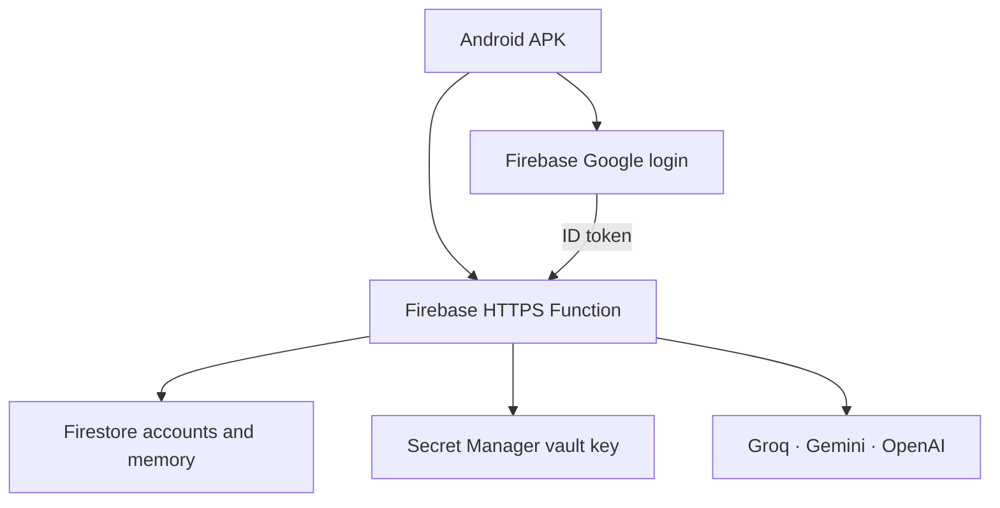

# KITTY Firebase architecture · 0.6

The phone sends a Firebase ID token on every authenticated API request. The server verifies the token and revocation/disabled-user status. Google provider, verified email and pinned owner UID determine admin access. No role or account ID supplied by the phone grants privileges.

The new server lives in `functions/`; no laptop process or VM is involved. Cloud Functions uses its runtime service account for Firestore and Firebase Auth. The setup guide covers production IAM, which emulators do not enforce.

Provider keys are AES-256-GCM encrypted in `private/config`. Secret Manager injects the master key into the function runtime. The admin sees connection flags rather than saved plaintext keys. Normal accounts cannot access admin configuration routes. Firestore rules deny direct client reads/writes; Admin SDK access uses IAM and server ownership checks.

Questions are answered using the owner-controlled system prompt, bounded recent context from the same account and session, and up to eight explicit personal memories. Memory is untrusted personalization data, not a way to edit stored core identity. Direct identity questions use a deterministic response. Prompt configuration does not change model weights.

Groq/OpenAI chat completion streams and Gemini Interactions streams are normalized to status/token/done SSE events. Thinking summaries are not rendered. Automatic fallback is attempted only before any visible text. A request ID is scoped to the user; completed retries return cached output, concurrent duplicates are rejected, and cancellation does not mark a partial reply successful.

The Android controller serializes database writes and captures the account for network operations. UI updates are throttled while streaming. Local SQLite keys and feedback acknowledgements use account-plus-ID keys; the v6 migration retains existing rows. Cloud history import does not overwrite pending local edits or assign old backend archives to a new Firebase account.

Server-generated replies are stored under `users/UID/turns`. Explicit memories are bounded to fifty entries. Phone outbox imports cannot overwrite authoritative server replies or become trusted model history. Training exports require a reviewed reply and current opt-in consent. No automatic fine-tuning or Drive backup job runs.

This edition supports typed chat and foreground reply playback. It has no background listener, accessibility automation, phone-control bridge or installer service. Inbox notices are fetched on demand. Update checks open official GitHub releases through Android's browser/installer.

See [the complete setup guide](START_HERE_V06.md).
